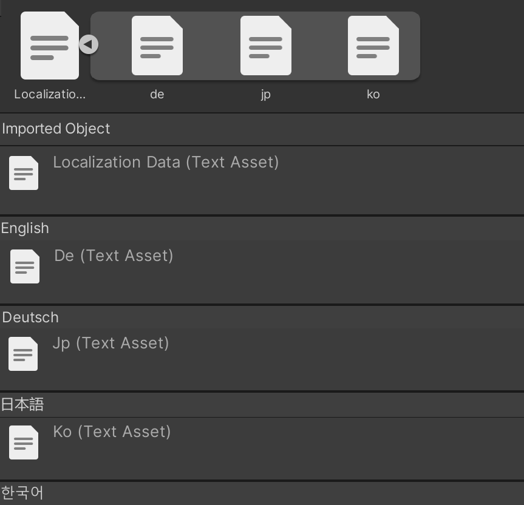

# Unity File Extension Editor Sample
Do you want to customize your editor in Unity by adding your own file extension? If so, try this sample.

## LocalizationData
### Sample File Data
```
List<LocalizationData> tests = new List<LocalizationData>()
{
    new LocalizationData("en", "English"),
    new LocalizationData("de", "Deutsch"),
    new LocalizationData("ko", "한국어"),
    new LocalizationData("jp", "日本語")
};
```

